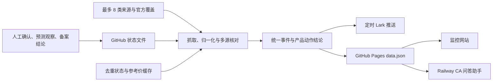

# CA Monitor 全量操作手册

> 适用版本：2026-09-04，Pages 数据契约 schema v4
>
> 适用对象：公司行动运营、现货/合约产品、风控、Issuer、钱包、客服、技术维护与值班人员
>
> 生产网页：[CA Monitor](https://vancoder4-cyber.github.io/CA-Monitor/)
>
> GitHub：[vancoder4-cyber/CA-Monitor](https://github.com/vancoder4-cyber/CA-Monitor)

本手册同时覆盖网站、定时 Lark 推送、CA 问答助手、人工确认、SEC filing 核验、GitHub Actions、Pages、Railway 和故障处理。业务规则以代码与 Pages 当前快照为准；本手册用于规定如何阅读和执行。

## 1. 先记住这六条

1. **看到公司行动，不等于合约需要操作。**所有事件照常报告；合约只有确认价格影响严格 `>3%` 才进入执行催办。
2. **3% 恰好不触发。**`≤3%` 明确显示「合约：本次无需操作」；缺数据时显示「待核实」，不能自行推断无需操作。
3. **预测、条款核验、门槛核验都不是执行指令。**卡片出现「待核实 / 勿执行」时，只做核验，不做调价、调乘数或客户资产处理。
4. **现货与合约分别判断。**现货+合约标的即使合约无需操作，现货的成本基准、持仓、对账和公告流程仍需完成。
5. **数据异常时必须 fail closed。**Bot 会停止输出业务结论；网站会显示红色异常提示但仍可能保留旧内容。看到快照过期、schema 不符或数据不可用时，操作员必须停止采信「无风险 / 无需操作」结论。
6. **修改一处，要验四个展示面。**网站、文本 digest、定时 Lark、问答助手必须使用同一事件、同一日期词、同一产品结论和同一核对链接。

## 2. 系统全景



### 2.1 四个生产面

| 生产面 | 作用 | 数据来源 | 出问题时看哪里 |
|---|---|---|---|
| GitHub Actions | 抓取、核对、推送、生成并发布 | 代码、Secrets、缓存 | Actions 的 `build` / `deploy` 步骤 |
| GitHub Pages 网站 | 全量日历、预警、来源健康、SEC 原文、更新日志 | `data.json` / `dashboard.html` | 页面顶部看生成时间、schema、commit、新鲜度；`data.json` 看 run、投递和完整时点 |
| 定时 Lark 推送 | 主动报告执行项、核验项和状态变化 | 本次 Actions 运行结果 | Action 的 Lark 投递步骤和群卡片 |
| CA 问答助手 | 按需查询、人工写回和审计 | 实时读取 Pages `data.json` | Railway 部署、Bot build commit、Pages 快照 |

定时推送机器人是 **Webhook 自定义机器人**；CA 问答助手是 **Lark 企业自建应用**。它们是两个独立组件，可以同时存在，也必须分别验收。

### 2.2 当前覆盖

- 现货：62 个标的。
- 合约：39 个标的。
- 去重后覆盖资产：81 个。
- 实际监控证券：75 个；商品等非证券资产可在覆盖中，但不进入证券公司行动抓取。
- 精确动态清单以网站「资产覆盖」或问答助手 `覆盖` 为准，不在手册中复制静态长名单。
- 输入别名：`BBX → BB`、`BRKB / BRK.B → BRK-B`、`QNTX → QNT`。

## 3. 角色与权限

| 角色 | 可以做什么 | 不应做什么 |
|---|---|---|
| 只读用户 | 查看网站；使用关于、帮助、风险、今日、本周、日历、查代码、留痕等查询 | 不写入确认、观察或备案结论 |
| 运营操作员 | 在只读能力上，使用确认、观察、备案结论、需求提报 | 不修改 Secrets、代码或生产缓存 |
| 业务负责人 | 审核高风险行动、超期异常、合约 `>3%` 操作方案及对外口径 | 不以单一未核实来源直接执行 |
| 仓库维护者 | 修改范围、规则、官方覆盖、测试和文档；发 PR | 不手改构建产物，不把密钥提交到 Git |
| 平台管理员 | 维护 GitHub Secrets、Railway Variables、Lark App/Webhook 与 Pages | 不新增敏感信息暴露；推动历史确认/观察身份数据迁入私有存储 |

问答助手的四类写操作——**确认、观察、备案结论、需求提报**——必须先通过 Railway Secret `LARK_WRITE_ALLOWED_OPEN_IDS`。未配置、发送人缺失或未命中白名单都会拒绝写入；查询不受影响。

## 4. 每日运营 SOP

### 4.1 扫描时间

系统按美东时间周一至周五运行三次：

- 09:35 ET：开盘后检查。
- 12:45 ET：盘中检查。
- 16:05 ET：收盘后检查。

GitHub 排队可能让实际启动略晚，但运行不会因为错过分钟而静默跳过。合入 `main` 或写入真正生效的确认状态，也会自动触发一次生产刷新。

当前调度只按星期判断，尚未接入美股交易所节假日日历；美股休市但属于周一至周五时仍可能运行，因此不要把“工作日运行”理解为已经做了完整交易日历判断。

### 4.2 上班后的第一轮检查

1. 打开生产网站，检查页面顶部的生成时间、schema、commit 和新鲜度提示。
2. 打开生产 [`data.json`](https://vancoder4-cyber.github.io/CA-Monitor/data.json)，检查 `source_sha`、Action `run_id`、`generated_at_utc` 和 `valid_until_utc`。
3. 在 `data.json` 检查 `delivery_status`：正常应为 `sent`；合法无消息可为 `legal_skip`。
4. 检查来源健康矩阵：限流或不可用要与「真正空缺」区分。
5. 查看风险、未来跟踪、字段冲突、数据空缺、三类核验和 filing 状态更新。
6. 在群里发 `@CA问答助手 关于`，确认「数据 commit」与「Bot build commit」一致。

任何红色「数据不可用 / 快照过期 / 版本不一致」都视为系统故障，先执行第 13 节故障 SOP，不得继续作业务结论。

### 4.3 事件处理优先级

| 优先级 | 状态 | 当班动作 |
|---:|---|---|
| P0 | 今日除息/生效且需要现货或合约执行 | 立即最终核对、执行既定方案、确认结果与对账 |
| P1 | `≤3` 天执行项、字段冲突、正式结构性行动 | 收尾方案；确认客户文案、参数、持仓和责任人 |
| P1 | 合约 `>3%` | 确认参考价、影响率、合约参数、风控和公告 |
| P2 | 公司行动条款核验 | 打开 SEC 原文，判断是否真公司行动；核实前勿执行 |
| P2 | 合约门槛核验 | 补金额、比例、币种、证券单位或参考价；核实前勿执行 |
| P2 | 单源预测核验 | 找公司公告或第二独立来源；预测不执行 |
| P3 | 合约 `≤3%` 且仅合约 | 保留信息记录；明确「本次无需操作」，不做重复催办 |
| P3 | 普通 SEC 备案 | 仅作原文审计，不进入公司行动执行流 |

### 4.4 收盘后的检查

1. 确认 16:05 ET 运行最终为绿。
2. 确认当天应处理事项没有停留在「无人负责」。
3. 对已核验冲突执行 `确认`；对 filing 执行精确 `确认备案` 或 `排除备案`。
4. 使用 `留痕` 复核写入结果。
5. 确认网站和 Bot 已出现最新状态；若未出现，检查生产工作流是否已被写回 commit 触发。

## 5. 如何阅读网站

### 5.1 页面版本与 `data.json`

网页顶部直接显示生成时间、监控数量、schema、commit 和快照新鲜度提示。commit/运行入口可用于跳转核对；以下完整字段以生产 `data.json` 为准：

- `schema_version`：当前必须是 4。
- `source_sha`：生成本次数据的 `main` commit。
- `run_id`：对应 GitHub Actions 运行。
- `generated_at_utc`：快照生成时间。
- `valid_until_utc`：快照的最晚可用时间。
- `delivery_status`：本批 Lark 是否已发送或合法静默。

版本信息不是装饰。Bot 会对 schema、必要字段和时效做硬门禁；网站会把时间异常显示为红色警告，但不会自动隐藏页面中已有的事件内容。因此任何字段缺失或过期时，都必须由操作员停止使用网页内容作业务结论。

### 5.2 公司行动日历

- 分红主日期显示「除息」。
- 拆股、合股主日期显示「生效」。
- 结构性 filing 显示「事件日」。
- 登记和派发是辅助日期，不代替主日期。
- 单源预测、条款核验和门槛核验应有明确的「待核实 / 勿执行」标识。
- 冲突通常以红色风险样式出现；核验项以待确认样式出现；已确认事件不代表每个数值都已通过门禁。

### 5.3 预警面板

重点区块包括：

- 未来跟踪事项。
- 临近执行与核验提醒。
- 新发现与新宣告。
- 字段冲突、数据空缺及已挂天数。
- 预测状态变化。
- 合约动作结论变化。
- filing 条款状态变化与未决归档。
- 数据源健康矩阵。

同一事件在生命周期区块中只保留最高优先级的一处，顺序为「filing 状态更新 → 执行催办 → 单源核验 → 合约结论更新 → 新宣告 → 新发现」。字段冲突和数据空缺属于独立异常区块，可能与上述生命周期区块同时出现，便于操作员单独消警。

### 5.4 SEC 原文区

网页中的 SEC 区是「近 90 天普通备案 + 公司行动相关文件」审计表：

- 普通 8-K / 6-K 只留作审计，不进入风险、日历或执行。
- 明确结构性 8-K / 8-K/A 可进入公司行动流。
- 外国发行人的 6-K / 6-K/A 只有元数据命中强提示时进入「公司行动条款核验」。
- 条款核验不等于正式行动；必须打开 SEC 原文后结案。

### 5.5 更新日志

网站展示根目录 `CHANGELOG.md` 的完整发布内容。问答助手 `最近更新` 展示最近三次版本；同一版本内的全部要点不应被截断。

## 6. 公司行动业务口径

### 6.1 事件日期词

| 事件 | 主日期词 | 其它日期 |
|---|---|---|
| 现金分红、送股 | 除息日 | 宣告、登记、派发 |
| 拆股、合股 | 生效日 | 宣告、登记等（如有） |
| 并购、退市、名称/代码变化等 filing | 事件日或明确生效日 | 申报日、交割日等 |

不得把拆股写成「除息」，也不得把 filing 申报日自动当成交割日。

### 6.2 事件是否正式，与数值是否可执行分开判断

事件可以已由公司正式宣告，但金额或比例仍可能冲突。此时：

- 事件继续正常报告。
- 冲突值不作为确定值展示。
- 合约动作保持待核实。
- 不得因为「官方日期已确认」就替单一供应商金额背书。

### 6.3 金额与比例门禁

只有以下情况可以作为确定值：

- 两个及以上独立来源一致且无冲突；或
- 已逐项核验的 Company IR / 官方本次公告本身包含该金额或比例；或
- 运营使用精确事件和有效值完成了人工确认。

以下情况都不可执行：

- 各源金额、比例或关键日期不同。
- 只有一个普通采集源。
- 官方覆盖只有日期、没有金额或比例。
- 币种、每股/每 ADS 单位不一致。
- 参考价缺失、过期、为未来日期或无效。

### 6.4 三种核验状态

| 核验类型 | 触发原因 | 操作 | 是否正式 @ |
|---|---|---|---:|
| 单源核验 | 未见宣告日且只有一个来源 | 找公司公告或第二来源 | 否 |
| 公司行动条款核验 | 6-K 等只命中疑似提示 | 打开 SEC 原文，结案为公司行动或普通备案 | 否，确认后另判 |
| 合约门槛核验 | 事件正式但 3% 输入不完整或冲突 | 补齐金额、比例、币种、单位、参考价 | 否，确认超过门槛后才是执行 |

### 6.5 现货与合约动作矩阵

| 产品 | 事件结论 | 系统表现 | 运营动作 |
|---|---|---|---|
| 现货 | 已确认公司行动 | 进入现货跟踪/催办 | 调整成本或持仓、对账、公告；按事件类型执行 |
| 仅合约 | 影响 `>3%` | 「合约：需操作」并进入催办/@ | 调参考价、乘数或相关合约参数，完成风控与公告 |
| 仅合约 | 影响 `≤3%` | 正常报告一次；「本次无需操作」；不重复催办 | 留痕，无合约参数动作 |
| 仅合约 | 无法判断 | 「合约：待核实」 | 补数据，勿执行 |
| 现货+合约 | 合约影响 `>3%` | 现货和合约均进入执行催办 | 分别完成现货处理与合约参数动作 |
| 现货+合约 | 合约 `≤3%` | 现货仍催办，合约写无需操作 | 完成现货动作；合约不操作 |
| 现货+合约 | 合约无法判断 | 现货仍催办，合约写待核实 | 现货按规则执行；合约补数据后再判断 |

### 6.6 合约 3% 规则

- 现金分红：`每股现金分红毛额 ÷ 参考价 × 100%`。
- 送股：按每股新增股份比例估算理论价格影响。
- 拆股/合股：按新旧股比例估算理论价格变化。
- 比较使用未舍入原始值；显示值才进行格式化。
- **严格大于 3%** 才触发；数学上恰好 3% 属无需操作。
- 参考价当前优先 Tiingo、回退 yfinance，采用前一完整交易日未调整收盘价，并必须在配置允许的有效期内。
- ADR/ADS 必须确认金额和报价对应同一币种、同一上市证券单位，并使用毛额；不一致直接进入待核实。
- 未来接入内部合约 Index/结算价后，应替换成与实际合约条款完全一致的分母。

### 6.7 提醒节奏

- 距除息/生效约 30 天：知会一次。
- 15–29 天：静默，不每日刷屏。
- 0–14 天：每个业务日最多提醒一次。
- 单源预测使用同样的 30/14 节奏，但只发核验，不发执行。
- 字段冲突和数据空缺每次扫描重报，并显示已挂天数；超过升级天数后 @ 负责人。
- 仅合约且 `≤3%` 不进入重复执行催办。
- filing 条款核验在事件日后未解决会继续跟进；超过 30 天转为「未决归档、停止日报」，但绝不能写成无需操作。

## 7. 按事件类型处理

### 7.1 现金分红

核对顺序：

1. 公司本次公告 / IR。
2. 精确 SEC filing。
3. 公司长期分红页或 SEC 公司备案入口。
4. StockAnalysis 仅作第三方交叉核对。

必须核对：每股毛额、币种、证券单位、宣告日、除息日、登记日、派发日，以及是否为普通股/ADR/ADS。现货做成本基准和持仓对账；合约再按 3% 判断是否操作。

### 7.2 送股

确认它是每股新增多少股，而不是现金金额。展示应类似「送股 0.1 股/股（10%）」；不得写成 `$0.1`。现货核对持仓数量和零碎股处理；合约按理论价格影响判断是否超过 3%。

### 7.3 拆股与合股

- 比例固定使用 `新股数:旧股数`。
- `2:1` 是每 1 股变 2 股；`1:10` 是十合一。
- 主日期统一叫「生效日」。
- 不得把 1.05、1.1、1.5 等小比例近似成 `1:1`。
- 人工确认必须输入完整比例，禁止只输入首个数字。

### 7.4 并购、分拆、退市、代码或名称变化

1. 先确认 filing 是否真实对应公司行动，不凭宽泛 8-K Item 猜测。
2. 核对明确的生效/交割日、换股或现金条款、旧新证券关系及是否终止交易。
3. 现货评估暂停交易、下架、持仓置换与公告。
4. 合约评估连续性、乘数、结算、指数源和强平风险。
5. 条款未清楚前保持核验状态，不得直接下结论。

### 7.5 字段冲突或数据空缺

- 打开卡片给出的权威链接和聚合核对链接。
- 不删除来源或覆盖层来消警。
- 确认正确值后用精确 `确认` 指令。
- 只有来源不可用时标「不可用」；不可把网络失败当成「该源没有事件」。

## 8. 老虎公司行动 API 对照方法

外部券商 API 只能作为输入源之一，先做字段映射，再与公司官方记录核对。

| 老虎字段 | 系统字段/含义 | 核对要点 |
|---|---|---|
| `announcementId` | 老虎内部事件 ID | 仅作追踪，不替代官方事件 ID |
| `symbol` | ticker | 先走 canonical alias 规范化 |
| `companyName` | 公司名 | 名称变化时不能只靠旧名称匹配 |
| `type=DIVIDEND` | 分红事件 | 继续判断现金还是证券分派 |
| `execDate` | 通常为除息/生效日 | 必须按事件类型和官方记录确认，不能理解为派发日 |
| `recordDate` | 登记日 | 与官方公告核对 |
| `payDate` | 派发日 | 与官方公告核对 |
| `cashMoveInfos.amount/currency` | 每股现金额与币种 | 确认单位是每股还是每 ADS，并确认毛额/净额 |
| `creditDebitIndicator=CRDT` | 现金贷记 | 表示给持有人入账；`DBIT` 则是扣记 |
| `securityMoveInfos` | 证券数量变动 | 送股、拆合股或换股时必须看完整内容 |

截至 2026-09-04 的已核验示例：HD 的老虎记录 `execDate=2026-09-03`、`recordDate=2026-09-03`、`payDate=2026-09-17`、`CRDT USD 2.33`，与 Home Depot 官方记录及当时系统事件完全一致；官方另给出宣告日 `2026-08-20`。若完整响应中的 `securityMoveInfos` 为空，按纯现金分红处理。

## 9. CA 问答助手完整指令

群聊格式：`@CA问答助手 + 指令`。私聊通常可不 @。

| # | 指令 | 示例 | 返回内容 | 写权限 |
|---:|---|---|---|---:|
| 1 | 关于 | `关于` | 系统用途、范围、数据源、数据/Bot commit | 否 |
| 2 | 帮助 | `帮助` | 全部指令说明 | 否 |
| 3 | 最近更新 | `最近更新` | 最近三次 CHANGELOG，当前版本完整要点 | 否 |
| 4 | 风险 | `风险` | 现货/合约独立动作、冲突、核验与结构事项 | 否 |
| 5 | 今日 | `今日` | T0 前后 24 小时关键日；正式与疑似分开 | 否 |
| 6 | 新公告 | `新公告` | 最近五个宣告事件及是否已结束 | 否 |
| 7 | 本周 | `本周` | 从美东业务日开始未来七个自然日的正式事项 | 否 |
| 8 | 临近催办 | `临近催办` | 0–14 天执行催办与三类核验 | 否 |
| 9 | 观察预测 | `观察预测` | 查看预测；也可写入单源观察 | 是（当前整条路由均校验） |
| 10 | 日历 | `日历` | 当月卡片和 PNG 月历 | 否 |
| 11 | 覆盖 | `覆盖` | 现货、合约、资产类型和监控状态 | 否 |
| 12 | 查代码 | `查 AAPL` | 单标的事件、关键日、产品动作及链接 | 否 |
| 13 | 备案结论 | `确认备案 <从卡片复制的完整 event_id>` | 用完整 event_id 结案 filing 核验 | 是 |
| 14 | 确认 | `确认 AAPL 0.26 2026-08-11` | 精确确认异常值并触发后续重算 | 是 |
| 15 | 留痕 | `留痕 AAPL` | 确认、观察和匿名备案结论记录 | 否 |
| 16 | 需求提报 | `需求 希望增加某功能` | 匿名编号写入公开需求队列 | 是 |

### 9.1 查询命令细节

- `今日`：包括除息/生效、登记、派发和宣告；疑似 filing 不计入正式事项数量。
- `本周`：是「今天起未来 7 个自然日」，不是固定周一到周日。
- `临近催办`：是 0–14 天窗口，不等于「本周」。
- `风险`：聚焦现货动作、合约需操作/待核实、冲突和结构事项；仅合约且已明确 `≤3%` 的无需操作事项不列入风险卡，可从新公告、日历或 `查代码` 查看。现货+合约会分别显示结论。
- `查代码`：支持 `查 AAPL`、直接发送 `AAPL`，以及受支持别名。
- `日历`：卡片和 PNG 必须同样执行数值门禁与 routine filing 过滤。
- `观察预测`：当前查看列表和写入观察共用同一路由，都会先校验写操作白名单。

### 9.2 数据故障时哪些命令可用

Pages 网络失败、schema 错误或快照过期时：

- 业务查询统一返回红色「数据不可用」，不会假报无风险。
- `帮助` 仍可用。
- 历史 `留痕` 可用。
- `需求提报` 在授权通过后可用，但正文仍受公开仓库隐私限制。
- 依赖当前事件快照的确认、观察和备案结论不得盲目执行。

## 10. 人工写回 SOP

以下示例按群聊书写，因此都包含 `@CA问答助手`；私聊时可省略此前缀。

### 10.1 确认金额或比例

现金示例：

```text
@CA问答助手 确认 AAPL 0.26 2026-08-11 已核对公司公告
```

拆/合股示例：

```text
@CA问答助手 确认 XYZ 1:10 2026-09-10 已核对 SEC 原文
```

执行前确认：

1. ticker 正确并在当前覆盖范围。
2. 事件类型和主日期正确。
3. 日期是分红除息日或拆合股生效日；filing 不走普通 `确认`，必须按第 10.3 节用完整 `event_id` 结案。
4. 金额单位、币种、每股/每 ADS 口径明确。
5. 同日存在不同类型事件时，不能用宽泛确认。

现金或送股的新确认只接受普通十进制的有限正数；空值、`0`、负数、`NaN` / `Infinity`、科学记数法和带千分位的输入都会被拒绝。拆/合股的新确认只接受冒号分隔的完整 `新股数:旧股数`；不能只填单一因子，也不能用 `1-10` 或 `1 for 10`。系统仍兼容读取历史合法单因子记录，但不会再接受这种格式的新写入。

写入成功后，异常列表可即时标记；最终金额门禁、3% 结论和各展示面由下一轮生产流水线统一重算。若卡片显示「仅留痕、未生效」，必须重试，不能当成已确认。

### 10.2 标记预测观察

```text
@CA问答助手 观察 AAPL 2026-10-15 等待公司正式宣告
```

- 系统会校验 ticker 是否属于当前监控证券；日期应由操作员确认是有效且仍在未来的 `YYYY-MM-DD`。当前写入口只识别日期字符串格式，不强制校验日历有效性或是否为未来日期，无效/过期记录虽会被下游跳过，仍可能进入公开审计文件。
- 已正式化或相近日期已存在正式事件时，不应再制造重复预测。
- 观察项只做核验，不执行；正式化、改期或失效时系统会推状态更新。

### 10.3 结案 SEC 条款核验

从核验卡复制完整 `event_id`，不要手输或截短：

```text
@CA问答助手 确认备案 <从卡片复制的完整 event_id>
@CA问答助手 排除备案 <从卡片复制的完整 event_id>
```

也可使用：

```text
@CA问答助手 备案结论 公司行动 <从卡片复制的完整 event_id>
@CA问答助手 备案结论 普通备案 <从卡片复制的完整 event_id>
```

event_id 的结构为 `TICKER|filing|YYYY-MM-DD|12位十六进制指纹`，但不要自行拼接或照抄手册中的示意值；必须从当前核验卡复制真实 ID。

安全规则：

- 同日多份 filing 必须按完整 ID 精确结案。
- ID 多一位、少一位或无法匹配时拒绝处理。
- 同一句同时出现「公司行动」与「普通备案」会 fail closed，要求重新明确输入。
- 「确认备案」会重新按现货/合约范围生成后续动作；「排除备案」明确为普通备案且不 @。
- 公开状态库只保存匿名业务结论，不保存本次操作员身份或自由备注。

### 10.4 查看留痕

```text
@CA问答助手 留痕
@CA问答助手 留痕 AAPL
```

离线导出：

```bash
python3 tools/export_ack_log.py
```

### 10.5 提报需求

```text
@CA问答助手 需求 希望覆盖新的公司行动类型
```

需求会以匿名编号写入公开 `requests.md`。不得填写客户姓名、账户、密钥、持仓明细、内部合同或其它敏感信息。

## 11. 定时 Lark 推送

### 11.1 卡片可能包含的区块

- 正式执行催办。
- 公司行动条款核验。
- 合约 3% 门槛核验。
- 单源预测核验。
- 预测、合约或 filing 状态更新。
- 新宣告与新发现。
- 字段冲突和数据空缺。

### 11.2 @ 规则

- 正式执行项可以 @ `LARK_ALERT_MENTION_OPEN_IDS` 中的负责人。
- 字段冲突/空缺超过升级天数可 @。
- 单源预测、条款核验、门槛核验本身不作为正式执行 @。
- 合约 `≤3%` 不触发重复催办或正式 @。
- `not_required → required` 等关键状态迁移即使不处于常规提醒轮次，也应主动推送并按需 @。

### 11.3 投递与去重

生产配置 `LARK_REQUIRED=1`。Webhook 缺失、明确的 HTTP/业务错误都会让 Action 失败，且不会保存本轮最终去重状态；但超时或投递后的后续步骤失败时，Lark 可能已经收到了卡片。修复后必须先核对群消息与 Action 最后成功步骤，再决定是否整轮重试。合法无提醒时不发送空卡，`delivery_status` 可记录为 `legal_skip`。

## 12. 仓库维护与发版

### 12.1 常用维护文件

| 文件 | 用途 | 注意 |
|---|---|---|
| `config.py` | 标的范围、类型、阈值、来源和别名 | 改范围必须同步计数、文档和测试 |
| `refs.json` | 官方 IR、精确 filing、官方事件覆盖 | 只录入实际打开并核验过的来源 |
| `contract_policy.py` | 合约 3% 动作判定 | 所有展示面不得自行平行计算 |
| `run.py` | 统一生产数据和状态 | schema 变更必须同步 Bot/验证器 |
| `report.py` | 网站和 digest | 必须消费统一事件字段 |
| `notify_lark.py` | 定时推送 | 检查去重、@ 与核验/执行分流 |
| `bot/cards.py` | 问答卡片与 16 个指令定义 | 指令唯一来源是 `COMMANDS` |
| `bot/bot.py` | 指令 dispatch 与权限入口 | 写操作必须在取数/写回前鉴权 |
| `CHANGELOG.md` | 网站和 Bot 最近更新唯一来源 | 每次用户可见修改都必须更新顶部 |
| `UPDATE_CHECKLIST.md` | 发版影响面和验收 | 每次变更照表执行 |
| `TODO.md` | 尚未完成的真实限制 | 不放一次性扫描结果 |

`site_data.json`、`dashboard.html`、缓存和本地 state 是构建产物或运行状态，不能手工编辑来伪造发布结果。

### 12.2 新增或移除标的

1. 修改 `SPOT_TICKERS` / `CONTRACT_TICKERS` 和资产类型。
2. 核对 ETF、ADR、NYSE/Nasdaq、FINX RIC、代码别名与公司名。
3. 为有稳定页面的标的补官方 IR；没有可靠页面就留空。
4. 评估首次纳入是否需要 baseline，避免历史事件整批刷屏。
5. 更新范围计数、README、Bot 说明、手册和 CHANGELOG。
6. 运行全量测试，并在发布后用 `覆盖` 验证实际 Pages 数据。

### 12.3 添加官方事件覆盖

在 `refs.json.official_event_overrides` 使用：

```text
TICKER|dividend|YYYY-MM-DD
```

至少记录官方 URL、标签、核验日期和已确认字段。日期覆盖不能替供应商单源金额背书；与自动源冲突时仍需报警调查。

### 12.4 修改问答指令

必须同步：

1. `bot/cards.py` 的 `COMMANDS`。
2. `bot/bot.py` 的 dispatch。
3. 根 README 指令表。
4. `bot/README.md` 指令表。
5. 本操作手册。
6. `CHANGELOG.md`。
7. `python3 tools/check_commands.py`。

### 12.5 修改任何用户可见功能

先查看 `UPDATE_CHECKLIST.md` 的影响面矩阵。尤其检查：

- 网站。
- 文本 digest。
- 定时 Lark。
- Bot 卡片及 PNG。
- Pages schema 与时效门禁。
- CHANGELOG → Pages → Bot 最近更新链路。

### 12.6 本地强制检查

```bash
python3 tools/check_commands.py
python3 -m unittest discover -s tests -v
python3 tools/check_surface_consistency.py
python3 -m py_compile run.py reconcile.py contract_policy.py sources.py report.py notify_lark.py bot/cards.py bot/ack.py bot/bot.py
if test -s data/state.json; then python3 tools/validate_state.py data/state.json; else echo "local state absent; production will restore it"; fi
bash -n tools/trigger.sh
env LARK_WEBHOOK='' LARK_SECRET='' LARK_REQUIRED=0 python3 run.py build
python3 tools/validate_public_snapshot.py site_data.json
git diff --check
```

即使关闭 Lark，`run.py build` 仍可能更新本地 `data/state.json`。应在隔离的测试 checkout 运行，或先备份本地 state；不要拿生产恢复出的唯一 state 做随意测试。

### 12.7 GitHub 发布流程

1. 从最新 `main` 建功能分支。
2. 修改代码、测试、文档和 `CHANGELOG.md`。
3. 本地检查全部通过。
4. 推送分支并创建 PR。
5. 等 PR CI 全绿，尤其是 Bot Docker smoke。
6. 合并到 `main`；不要直接强推。
7. `main` push 自动触发生产 CA Monitor。
8. 确认 Actions 的 build 和 deploy 都成功。
9. 核对 Pages `data.json` 的 schema、commit、run、投递状态、有效期和 changelog 首条。
10. 确认 Railway 已部署同一 commit，并完成只读与授权/未授权 smoke。

手动触发并等待验收：

```bash
./tools/trigger.sh
```

脚本会锁定本次 `workflow_dispatch + main SHA + run_id`，避免误拿并发运行，并等待 Pages CDN 发布同一快照。

### 12.8 回滚

- 使用新的 revert PR 回滚，不执行 `git reset --hard` 或强推 `main`。
- 不要回滚到只认识旧 state/cache 的 workflow；否则可能丢失去重状态并重放历史事件。
- 回滚前确认 schema、Bot 兼容性、state 迁移和 Pages/Railway 发布顺序。
- 回滚后仍须执行完整生产验收。

## 13. 故障处理 SOP

| 现象 | 常见原因 | 处理 |
|---|---|---|
| Actions 红，核心 state 恢复失败 | 缓存不存在或 workflow 版本错误 | 停止发布，检查 core/legacy cache；不要用空 state 强跑 |
| Actions 红，Lark 投递失败 | Webhook/签名/网络/Lark 业务错误 | 修复 Secret 或网络后重跑；去重状态尚未推进 |
| Lark 已收到卡片，但 Action 后续红 | 公开快照校验或后续步骤失败 | 重跑前先核对群消息；此时 cache 可能尚未保存，整轮重跑存在重复推送风险 |
| build 绿、deploy 红 | Pages artifact 或权限问题 | 检查 upload/deploy 步骤和 Pages Source |
| 网站显示快照过期 | 计划运行未启动、发布失败或有效期计算问题 | 查最近 Action；恢复前不采信无风险结论 |
| Bot 返回数据不可用 | Pages 网络、schema、必要字段、时间或有效期不合格 | 先修 Pages/producer，不要让 Bot 降级使用旧数据 |
| 网站正常、Bot 还是旧样式 | Railway 未部署当前 commit | 对比 `关于`中的两个 commit，重新 Deploy Railway |
| 写操作未授权 | allowlist 未配、发送人缺失或不在名单 | 管理员更新 Railway Secret；不要把名单发到群里 |
| 写操作显示仅留痕未生效 | 核心状态文件写入失败 | 重试；在 `留痕` 和 GitHub 中确认，不要当作完成 |
| 没有收到定时推送 | 本轮合法无内容、Action 排队或 Webhook 失败 | 查 `delivery_status` 和 Action 日志；区分 `legal_skip` 与失败 |
| 某源显示不可用 | 限流、凭证、网络或付费墙 | 修复源；不可用不是空缺，也不代表没有事件 |
| 突然出现大量历史事件 | 去重 state 未恢复或新标的未 baseline | 立即停止生产，检查 cache；不要逐条人工消警 |
| 同一事件重复出现 | event_id、跨源归组或区块去重失效 | 比对 URL/日期/类型；先保留证据，再修 identity 逻辑 |
| filing 长期待核实 | 没有人工结案或无法自动关联 | 打开 SEC 原文，以完整 event_id 结案；30 天后仅归档，不下业务结论 |

如果 `build` 已完成、Lark 已发且核心状态 cache 已保存，只是 `deploy` job 失败，优先只重跑失败的 deploy job，避免无必要地重新抓取和推送。当前系统保证故障时保留上一版 Pages，但不能承诺所有后续失败场景都做到端到端 exactly-once。

### 13.1 最小故障证据包

向技术值班反馈时附：

- 发生时间与时区。
- GitHub Action `run_id` 和失败步骤。
- Pages `source_sha`、schema 和有效期。
- Bot build commit。
- ticker、事件类型、主日期和 `event_id`。
- 卡片截图及对应官方/SEC URL。

不要在证据包中包含 PAT、Webhook、App Secret、完整 `.env` 或客户数据。

## 14. Secrets 与安全

### 14.1 GitHub Actions Secrets

- `ALPHAVANTAGE`
- `FMP`
- `TIINGO`
- `ALPACA_KEY_ID`
- `ALPACA_SECRET`
- `SEC_UA`
- `FINX_USER` / `FINX_PASS` / `FINX_BASE`（可选）
- `LARK_WEBHOOK`
- `LARK_SECRET`（启用签名时）
- `LARK_ALERT_MENTION_OPEN_IDS`

仓库变量可配置 `LARK_DASHBOARD_URL`。

### 14.2 Railway Variables

- `LARK_APP_ID`
- `LARK_APP_SECRET`
- `SITE_URL`
- `GH_TOKEN`
- `LARK_WRITE_ALLOWED_OPEN_IDS`
- `GH_REPO` / `GH_BRANCH`（可选）
- `HEARTBEAT_URL`（建议）

### 14.3 安全红线

- `.env`、PAT、Webhook、App Secret 不得提交到 GitHub。
- 两个 open_id 名单用途不同，不得复用：一个负责被 @，一个负责写权限。
- 不得把 allowlist 发布到 Pages、日志、卡片或文档。
- 公开 Pages 会暴露覆盖范围、事件和运行版本；需要私有访问时应更换托管方案。
- 当前确认/观察写回仍会把操作员身份与自由备注写进公开 Git 文件，旧 `ack_log/acknowledged/forecast_watch` 也存在同类历史数据；只有 filing 结论按匿名业务状态保存。完成私有存储迁移前，确认、观察和需求文本都禁止写客户、账户或其它敏感信息。
- 清理公开 Git 历史属于破坏性动作，必须经过批准、备份并评估标识轮换。

## 15. 已知限制

- 3% 当前使用外部前一交易日收盘价，不是内部合约实际 Index/结算参考价；临界事项需额外人工核对。
- Alpha Vantage 免费额度只能覆盖部分标的；它是补充源，不是全量主源。
- FMP 免费版对部分标的可能返回 402，系统应标不可用。
- 宽泛 8-K / 6-K 尚未做全文级精确条款解析；当前坚持保守分流和人工结案。
- 外部 workflow dead-man 主动告警尚待补充；当前网站和 Bot 会在过期后 fail closed，但不能替代独立存活监控。
- 旧确认/观察审计数据仍待迁入私有存储。

## 16. 一页式验收清单

### 每日

- [ ] 网站顶部生成时间、schema、commit、新鲜度正常；`data.json` 的 run、有效期和 delivery 正常。
- [ ] `关于`中的数据 commit 与 Bot build 一致。
- [ ] 今日/临近执行项已有人负责。
- [ ] 三类核验没有被当成执行。
- [ ] 合约 `≤3%` 显示无需操作且未重复催办。
- [ ] 冲突/空缺和 filing 条款核验已跟进或结案。

### 每次人工写回

- [ ] 操作员已授权。
- [ ] ticker、类型、日期或完整 event_id 精确。
- [ ] 金额/比例、币种和证券单位已核实。
- [ ] 回执不是「仅留痕、未生效」。
- [ ] 后续 Action 已运行，网站、Lark、Bot 状态一致。

### 每次发布

- [ ] 影响面已覆盖网站、digest、Lark、Bot 和 PNG。
- [ ] `CHANGELOG.md` 顶部已写真实当天更新。
- [ ] 所有本地与 CI 检查通过。
- [ ] PR 合并到 `main`，生产 build/deploy 全绿。
- [ ] Pages 快照与 `main` SHA、run_id、changelog 一致。
- [ ] Railway 部署同一 commit。
- [ ] 授权账号能写、未授权账号不能写。

### 故障时

- [ ] 先停用业务结论，不用旧数据猜。
- [ ] 保存 run_id、commit、event_id 和官方链接。
- [ ] 不清空 state、不强推 main、不删除冲突来源。
- [ ] 修复后重跑并完成四个生产面验收。

## 17. 快速入口

- 生产网站：<https://vancoder4-cyber.github.io/CA-Monitor/>
- GitHub：<https://github.com/vancoder4-cyber/CA-Monitor>
- Actions：<https://github.com/vancoder4-cyber/CA-Monitor/actions>
- [操作影响面检查](UPDATE_CHECKLIST.md)
- [Bot 部署说明](bot/README.md)
- [群内简版说明](docs/CA监控_群briefing.md)
- [人工确认清单](docs/CA_人工确认清单.md)
- [更新记录](CHANGELOG.md)
- [尚未完成事项](TODO.md)
